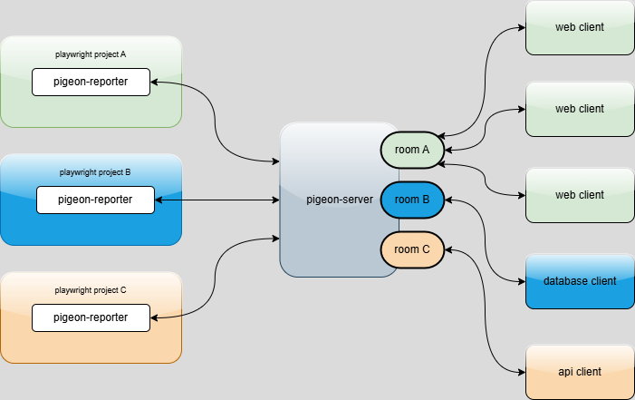

# pigeon-reporter

**pigeon-reporter** helps you see your Playwright test results live, as they happen. It acts as a messenger between your Playwright tests and any app or dashboard you want to build. When your tests run, pigeon-reporter sends updates in real time to a server, so you (or your team) can watch progress, catch failures quickly, or store results for later. You will need a [pigeon-server](https://www.npmjs.com/package/pigeon-server) running in between the reporter and your app.

## Why use it?

- Instantly see which tests pass or fail, without waiting for the whole suite to finish.
- Build dashboards or notifications that react to test events.
- Easily connect your Playwright tests to other tools or databases.

---

## Installation

Install with npm:

```bash
npm install pigeon-reporter
```

---

## How to use in your Playwright project

1. **Install pigeon-reporter** (see above).
2. **Add the reporter to your Playwright config:**

   In your `playwright.config.ts` or `playwright.config.js`:

   ```ts
   export default {
     // ...existing config...
     reporter: [
       ['pigeon-reporter',
        { liveReportingSocketEndpoint: 'http://localhost:3004',
         projectId: 'dv98729f987v982734', //some random unique projectId
         sendScreenshots: false }], // whether to send screenshots if available, default: true
       // ...other reporters if needed...
     ],
   };
   ```
   - `liveReportingSocketEndpoint`: The URL where your pigeon-server is running.
   - `projectId`: A unique id for your project (used to create a socket.io room ).

3. **Start your pigeon-server** (see above).
4. **Run your Playwright tests as usual.**

---


## How it works

- Each Playwright project using pigeon-reporter sends test events to the server:
  - `TEST_RUN_STARTED`: on test run initialized
  - `TEST_STARTED`: on individual test execution start
  - `TEST_COMPLETED`: on individual test run finish and results available
  - `TEST_RUN_COMPLETED`: on suite run completed

- Each message contains `projectId` inside, so the server later can forward the message to the corresponding socket.io room (see more about [socket.io rooms](https://socket.io/docs/v3/rooms/))
- The server broadcasts these events to all clients subscribed to that project's room.
- Clients (such as dashboards or databases) connect and subscribe to a project room to receive live updates from the server.



This setup allows you to:

- Visualize test results in real time
- Store results in a database
- Build custom integrations for your test events

---

## Author

Filip Kantardjioski

[https://github.com/kantarogit](https://github.com/kantarogit)

## Contributing

1. Fork the repository
2. Create your feature branch (`git checkout -b feature/amazing-feature`)
3. Commit your changes (`git commit -m 'Add some amazing feature'`)
4. Push to the branch (`git push origin feature/amazing-feature`)
5. Open a Pull Request

## License

This project is licensed under the ISC License.


